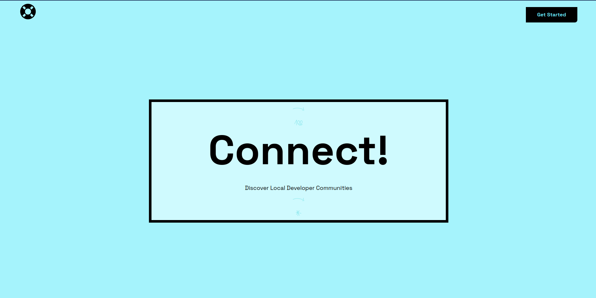

<!-- # Project Name: Dev Ring -->

Live: [https://contriquest.vercel.app/](https://contriquest.vercel.app/)

# Dev Ring

`Dev Ring` is an open-source web application platform that ranks developers based on their projects' activity and impact. 
It aims to provide a centralized platform for developers `to track and showcase their work`, `collaborate with others`, `compare themselves to top developers` and `gain recognition within the developer community`.

This platform can also be used by `employers` to easily find `developers` who best suits their companies.

## Tech Stack

`Dev Ring` is built using the following technologies:

### Server-side

- [Firebase](https://firebase.google.com/)

### Client-side

- [ReactJS](https://react.dev)
- [TypeScript](https://www.typescriptlang.org/docs)
- [TailwindCSS](https://tailwindcss.com/)

### DevOps 
- [Docker](https://www.docker.com/)
